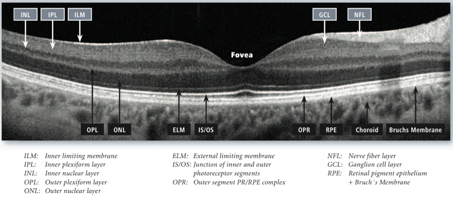
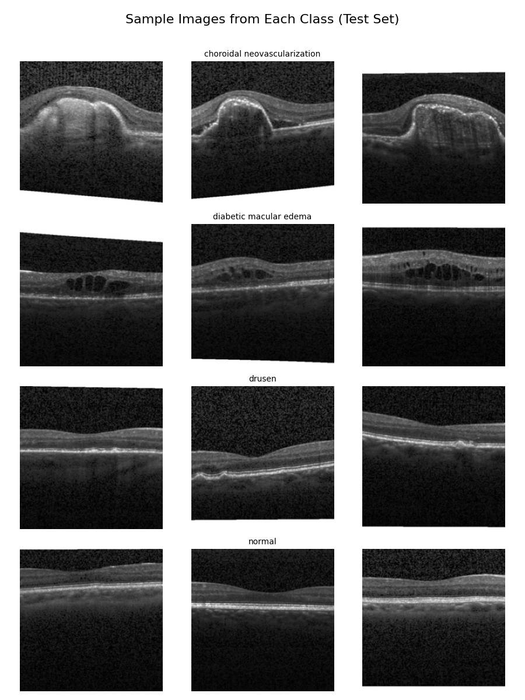

# OCT (Optical Coherence Tomography)  
OCT (Optical Coherence Tomography) is a non-invasive imaging technique that provides high-resolution cross-sectional images of tissue structures using infrared light (800–1300 nm). It operates on the principle of low-coherence interferometry, where light is reflected from different tissue layers, and the time delay of these reflections is used to construct a tissue image.

The generated images, called B-scans, are cross-sectional views, with each vertical line representing a depth measurement (A-scan). Multiple A-scans are combined to create a 2D representation of the tissue.


<br>Image source: https://eyeguru.org/essentials/interpreting-octs/

## OCTMNIST
The **OCTMNIST** dataset is a collection of retinal images obtained using Optical Coherence Tomography (OCT), designed for the task of classification in the context of eye diseases. It consists of OCT scans, each labeled into one of four classes corresponding to different retinal conditions:

1. **Class 0 (Choroidal Neovascularization - CNV)**: Characterized by abnormal blood vessel growth beneath the retina, commonly associated with conditions like wet age-related macular degeneration (AMD). It can lead to vision distortion and loss if left untreated.
   
2. **Class 1 (Diabetic Macular Edema - DME)**: Refers to the swelling of the macula, a part of the retina, due to diabetes. This condition leads to central vision impairment and is a common cause of blindness in diabetic patients.

3. **Class 2 (Drusen)**: Depicts the presence of small yellow deposits beneath the retina, often related to age-related macular degeneration (AMD). Drusen can affect vision, but in the early stages, the condition may be asymptomatic.

4. **Class 3 (Normal)**: Represents healthy, unaffected retinal scans with no visible signs of disease. This class serves as the baseline for distinguishing between pathological conditions.

| Class | Description                  | Number      | Percentage share |
|-------|------------------------------|-------------|--------------------|
| 0     | Choroidal neovascularization | 37,455      | 34.26%             |
| 1     | Diabetic macular edema       | 11,598      | 10.61%             |
| 2     | Drusen                       | 8,866       | 8.11%              |
| 3     | Normal                       | 51,390      | 47.02%             |
| **–** | **Total**                  | **109,309** | **100.00%**        |



## Model
The model used for the OCTMNIST dataset is a fine-tuned version of the **EfficientNet-V2-s** architecture, which is a convolutional neural network (CNN) designed for image classification tasks. The model is pre-trained on the ImageNet dataset and then adapted to classify OCT images into the four classes mentioned above.
<br>Hyper-params optimization and final training are performed only on the sliced training (60,000) and validation (9,000) sets, which are subsets of the original dataset. The training set is used for model optimization, while the validation set is used to evaluate the model's performance during final training. The test set is used for evaluation after final training.

## Optimization
Optimization is performed using only the training set. Cross-validation is used to evaluate the model's performance, with the training set split into 3 folds. The best hyperparameters are selected based on the average `disease recall` across these folds.
<br>**Focal loss** is used as the loss function to address class imbalance in the dataset. The gamma parameter of the focal loss is optimized as part of the hyperparameter search.

Search for the best hyperparameters using the Optuna framework. The search space includes:
- **Learning Rate**: A float value between 1e-5 and 1e-2,
- **Batch Size**: An integer value from the set {128},
- **Weight Decay**: A float value between 1e-6 and 1e-2,
- **Dropout Rate**: A float value between 0.0 and 0.7,
- **Optimizer**: A categorical choice from the set {'RMSprop', 'Adam', 'AdamW'},
- **Number of Unfrozen Layers**: An integer value between 0 and 20 - the number of layers in the pre-trained model that are unfrozen for training after feature extraction,
- **Dense Units**: An integer value from the set {32, 64, 96, 128, 160, 192, 224, 256} - the number of units in the dense layer,
- **Focal Loss Gamma**: A float value between 1.0 and 3.0,
- **Feature Extraction Epochs**: An integer value between 4 and 8 - the number of epochs for feature extraction,
- **Patience**: An integer value between 5 and 10 - the number of epochs with no improvement after which training will be stopped.

### Optimization contains
1. **Data Preparation**: Load and preprocess the OCTMNIST dataset, including normalization and augmentation.
2. **Model Definition**: Define the EfficientNet-V2-s model with a custom head for classification and frozen layers for feature extraction.
3. **Prepare the model for training**: 
   - Compile the model with the specified optimizer, loss function (`focal loss`), and metrics.
   - Set up callbacks for early stopping and TensorBoard logging.
4. **Training**: 
   - Train the model for a specified number of epochs with frozen layers.
   - Unfreeze the specified number of layers for fine-tuning.
   - Train the model again with the unfrozen layers.
   - Evaluate the model on the validation set and calculate the disease recall.

### Run
```
python optimization.py
```
The results are saved in the Optuna database (`optuna_study_oct.db`), and the best hyperparameters are printed to the console.
TensorBoard logs are saved in the `runs/` directory.

## Training and Evaluation
The final training and evaluation of the model are performed using the best hyperparameters obtained from the optimization process. The training is done on the sliced training set (60,000 samples) and validated on the sliced validation set (9,000 samples). The test set (10,000 samples) is used for final evaluation.
<br><br>
The results of the final training and evaluation are saved in the following structure:
- `models/model_X/` for model weights
- `results/model_X/` for individual model results
- `logs/model_X.log` for model-specific logs
- `results/combined_test_metrics.json` for combined results

## Dataset Source
https://medmnist.com/ <br>
code: https://github.com/MedMNIST/MedMNIST <br>
dataset: https://zenodo.org/records/10519652 <br>
paper: https://www.nature.com/articles/s41597-022-01721-8 <br>

Jiancheng Yang, Rui Shi, Donglai Wei, Zequan Liu, Lin Zhao, Bilian Ke, Hanspeter Pfister, Bingbing Ni. Yang, Jiancheng, et al. "MedMNIST v2-A large-scale lightweight benchmark for 2D and 3D biomedical image classification." Scientific Data, 2023.

Jiancheng Yang, Rui Shi, Bingbing Ni. "MedMNIST Classification Decathlon: A Lightweight AutoML Benchmark for Medical Image Analysis". IEEE 18th International Symposium on Biomedical Imaging (ISBI), 2021.
